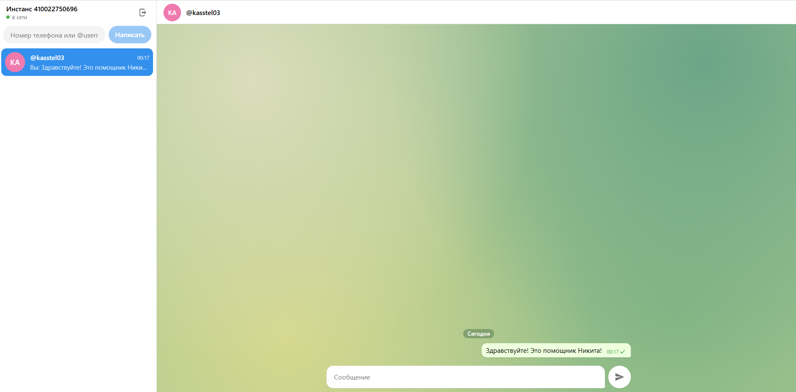

# tg-green-chat

Простой веб-чат для Telegram на GREEN-API. Тестовое задание на позицию фронтенд-разработчика.

В задании можно было взять MAX, WhatsApp или Telegram, здесь Telegram. API у него почти
такой же, как у MAX, так что переделать под MAX несложно.

Стек: React, TypeScript, Vite. Своего бэкенда нет, браузер ходит в GREEN-API напрямую.

Попробовать без установки: https://kasstel.github.io/GreenApi_test/





Ещё скриншоты: [вход](docs/screenshots/login.png), [мобильная версия](docs/screenshots/mobile_2.png), [мобильная версия](docs/screenshots/mobile_1.png). На скриншотах тестовые данные.

## Запуск

Нужен Node.js 20 или новее.

```bash
npm install
npm run dev
```

Приложение откроется на http://localhost:5173. Тесты запускаются через `npm test`, сборка через `npm run build`.

## Как пользоваться

Понадобится инстанс GREEN-API типа Telegram, авторизованный в личном кабинете (вход по
номеру телефона и коду из Telegram). На экране входа вводятся `apiUrl`, `idInstance` и
`apiTokenInstance`, всё это есть в кабинете. Про `apiUrl` в задании ничего не сказано,
но без него не обойтись: у разных инстансов он разный.

Дальше как в обычном мессенджере: вводите номер телефона или @username собеседника,
пишете сообщение и жмёте Enter. Ответ появится в чате сам.

Что может пойти не так:

- если собеседник запретил искать себя по номеру, GREEN-API ответит, что аккаунта нет.
  Тогда можно открыть чат по @username;
- на бесплатном тарифе можно переписываться только с тремя чатами.

## Как это устроено

Чтобы написать человеку, сначала нужен его `chatId`. В Telegram это просто число, из
номера телефона его не получить, поэтому сначала идёт запрос `checkAccount`, а потом уже
`sendMessage`. Сообщение появляется в чате сразу, не дожидаясь ответа сервера.

Входящие забираются через HTTP API, как требует задание. В цикле берём уведомление через
`receiveNotification`, обрабатываем и удаляем через `deleteNotification`. Удалять нужно все
уведомления подряд, даже ненужные, иначе очередь застрянет. Если пропала сеть, запросы
повторяются с растущей паузой, максимум раз в 30 секунд.

Своё же отправленное сообщение GREEN-API присылает обратно в ту же очередь, поэтому
сообщения сверяются по `idMessage`, чтобы не было дублей. Статусы (доставлено, прочитано,
ошибка) показываются галочками, как в Telegram.

```
src/
  api/          запросы к GREEN-API
  lib/          разбор номеров и уведомлений, состояние чатов (есть тесты)
  hooks/        вход, опрос очереди, чаты
  components/   экраны и компоненты
```

Redux здесь не нужен, состояния мало, хватает `useReducer`.

## Про токен

`apiTokenInstance` даёт полный доступ к аккаунту, а здесь он хранится в браузере, в
sessionStorage до закрытия вкладки. Для тестового задания это нормально. В настоящем
проекте токен лучше держать на сервере и ходить в GREEN-API через свой бэкенд.
